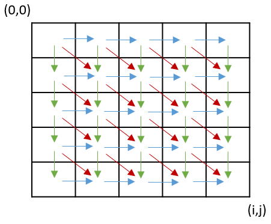
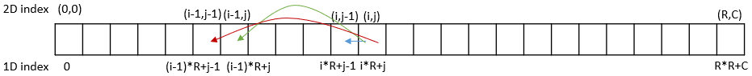
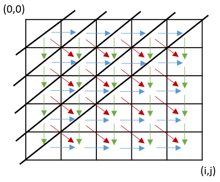

# Multidimensional Recurrent Neural Networks

#### Note: This code is offered without any warranty and was developed as a way to learn the new version of tensorflow 2.0. Finally, any contributions are welcome

## TL; DR: What is currently implemented/working?
  * two-dimensional loop with 3 states (left, top, diagonal)
  * Spatial-GRU or 2D-GRU (kinda works, need more testing) (article: arXiv:1604.04378)


# Table of contents

<!--ts-->
   * [Table of contents](#table-of-contents)
   * [Introduction](#installation)
   * [How it works](#installation)
   * [Installation](#installation)
   * [Usage](#usage)
   * [Tests](#tests)
   * [Currently missing](#missing)
   * [Future improvements](#improvements)
<!--te-->


# Introduction

This repository aims to offer a multidimensional recurrent function, implemented in tensorflow 2.0 with Keras API, that can be used by multiple recurrent cells (RNN/GRU/LSTM).

As best of my knowledge this is the first publicly available repository that tries to implement this type of function in tensorflow 2. Furthermore, I was able to find ONLY one repository that tries to implement a [multidimensional-lstm](https://github.com/philipperemy/tensorflow-multi-dimensional-lstm) in tensorlflow 1.7.

It is worth to mention the [RetuRNN](https://github.com/rwth-i6/returnn) framework, that also offers a (GPU-only) multidimensional LSTM.

In terms of literature, these are some works that used/proposed this type of recurrency for "text" and "image" tasks:

  * [Match-SRNN: Modeling the Recursive Matching Structure with Spatial RNN](https://arxiv.org/pdf/1604.04378.pdf)
  * [DeepRank: A New Deep Architecture for Relevance Ranking in Information Retrieval](https://arxiv.org/abs/1710.05649)
  * [Modeling Diverse Relevance Patterns in Ad-hoc Retrieval](https://arxiv.org/pdf/1805.05737.pdf)
  * [Multi-Dimensional Recurrent Neural Networks](https://arxiv.org/pdf/0705.2011.pdf) (Probably  the first work to describe mdrnn)
  * [Handwriting Recognition with Large Multidimensional Long Short-Term MemoryRecurrent Neural Networks](https://www.vision.rwth-aachen.de/media/papers/MDLSTM_final.pdf)

# How it works

### In theory

A multidimensional RNN is similar to a one-dimensional recurrent neural network, but instead of using only one state (the output of the previous step), it uses multiples states, normally one per dimension.

The following image shows an example applied to two-dimensional data, where each entry has access to three previous states (left in blue, top in green and diagonal in red).However, in some works, only the left and top states are used.



So each state in a mdrnn is computed by a recursive function of its previous states and input.


### In practice

The current implementation follows a naive approach that iterates sequentially over every 2D entry (first column dimension and then row dimension), feeding the previous computed states (left, up, diagonal).




A GPU/CPU optimization could be achieved by computing the opposed diagonals in parellel since each entry in an opposed diagonal is independent, as presented in the following image by the black lines. However, note that there still is a sequential dependency between the black lines that must be respected.



# Installation
(Working in progress)

1. For now, clone the repository
* (optional install as a python package)
2. python setup.py sdist
3. pip install dist/tfmd-0.0.1.tar.gz

# Usage

```python
# normal tensorflow keras imports
from tensorflow.keras import Sequential
from tensorflow.keras.layers import Dense

# multidimensional rnn imports
from tfmd.mdrnn import MultiDimensionalRNN
from tfmd.mdcells import MultiDimensinalGRUCell

gru_units = 4

model = Sequential()
model.add(MultiDimensionalRNN(MultiDimensinalGRUCell(gru_units, activation='tanh'), input_shape=(5,5,1)))
model.add(Dense(1))

model.summary()

# normal keras model :D
```

# Tests

# Currently missing

# Future improvements

Contributions are welcome!!

* More gates (LSTM)
* CPU/GPU improvement using the idea of opposed diagonal
* Multidirictional recurrency
